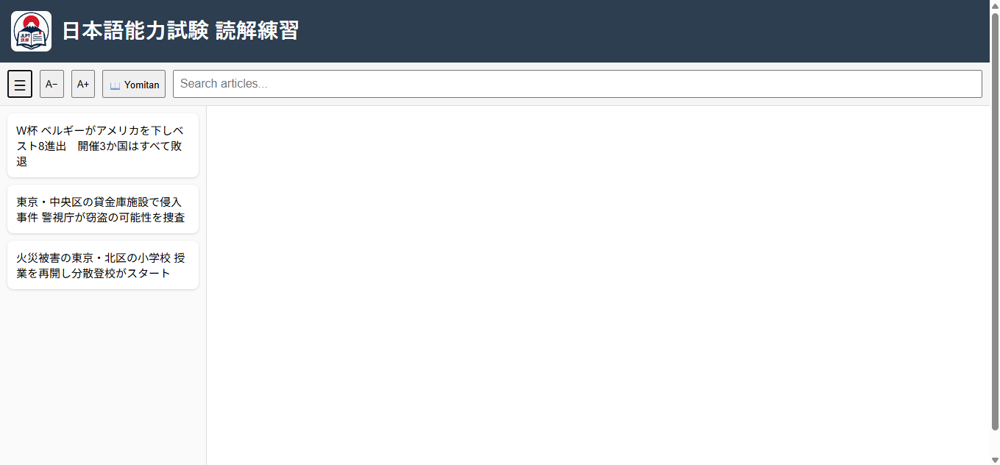
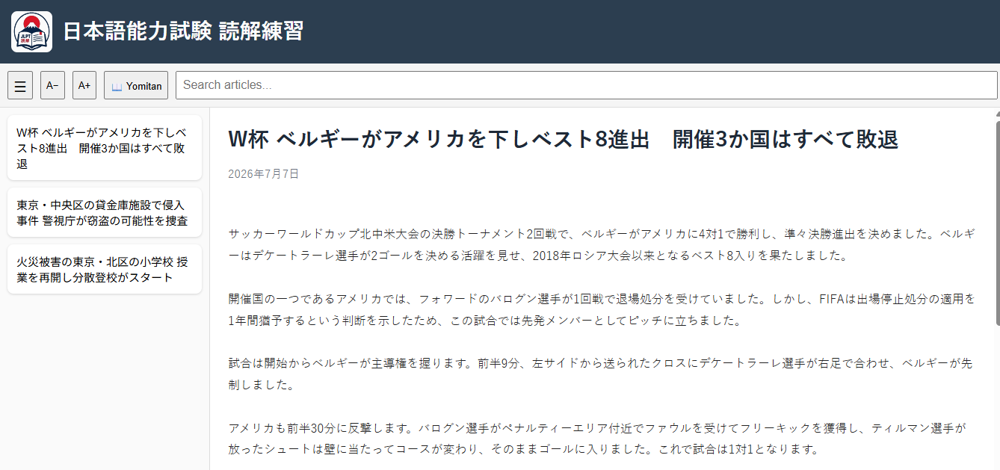

# JLPT Reading Trainer

**日本語能力試験（JLPT）読解練習サイト**

A lightweight web application for practicing **JLPT reading comprehension** with authentic Japanese news articles.

Demo:
https://neil-brown.github.io/jlpt-reading-trainer/

The goal of this project is to provide a clean, distraction-free reading environment where learners can improve their Japanese through extensive reading.

---

## ✨ Features

* 📖 Read authentic Japanese news articles
* 🔍 Search articles by title
* 🔎 Full compatibility with **Yomitan** for instant dictionary lookups
* 🔠 Adjustable font size
* 📱 Responsive design for desktop and mobile
* ⚡ Fast and lightweight (no frameworks required)

---

## 📸 Screenshots

### Home



### Reading an article



---

## 🚀 Getting Started

Clone the repository:

```bash
git clone https://github.com/Neil-Brown/jlpt-reading-trainer.git
```

Open the project folder and run it using a local web server such as **VS Code Live Server**.

---

## 📂 Project Structure

```text
.
├── articles/
├── img/
├── app.js
├── style.css
├── files.json
├── index.html
└── README.md
```

---

## 📖 Using Yomitan

This project is designed to work with the **Yomitan** browser extension.

1. Install Yomitan.
2. Add a Japanese dictionary.
3. Hover over words while reading to see definitions and pronunciations.

---

## 🛠 Technologies

* HTML5
* CSS3
* JavaScript (Vanilla)

---

## 🤝 Contributing

<p>
Contributions are welcome! You can help improve this project in several ways:
</p>

<ul>
  <li>
    <strong>Submit articles</strong> — Share JLPT-related learning articles, explanations, reading materials, or useful resources.
    Articles should be submitted using the following format:
  </li>
</ul>

<pre>
&lt;h1 id="articleTitle"&gt;Article Title&lt;/h1&gt;

&lt;div id="articleDate"&gt;YYYY-MM-DD&lt;/div&gt;

&lt;pre id="articleBody"&gt;
Article content goes here...
&lt;/pre&gt;
</pre>

<ul>
  <li><strong>Report bugs</strong> — Found an issue? Please open a GitHub Issue with details about the problem and steps to reproduce it.</li>
  <li><strong>Suggest improvements</strong> — Ideas for new features, content, or usability improvements are welcome.</li>
  <li><strong>Submit code changes</strong> — Pull requests are welcome for improvements and fixes.</li>
</ul>

---

## 📄 License

This project is licensed under the MIT License.

